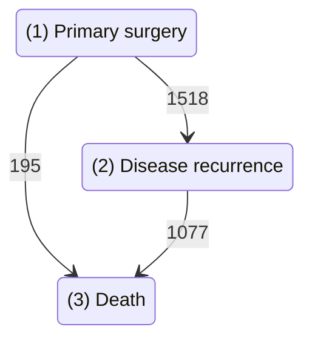

[](https://pypi.org/project/pymsm/)
[](https://github.com/hrossman/pymsm/actions?workflow=Tests)
[](https://codecov.io/gh/hrossman/pymsm)
[](https://hrossman.github.io/pymsm)
[](https://zenodo.org/badge/latestdoi/443028256)

  

Multistate competing risk models in Python  
  
[Read the Docs](https://hrossman.github.io/pymsm/)  
  
[Hagai Rossman](https://hrossman.github.io/), [Ayya Keshet](https://github.com/ayya-keshet), [Malka Gorfine](https://www.tau.ac.il/~gorfinem/) 2022


`PyMSM` is a Python package for fitting competing risks and multistate models, with a simple API which allows user-defined model, predictions at a single or population sample level, statistical summaries and figures.  

Features include:

- Fit a Competing risks Multistate model based on survival analysis (time-to-event) models.
- Deals with right censoring, competing events, recurrent events, left truncation, and time-dependent covariates.
- Run Monte-carlo simulations for paths emitted by the trained model and extract various summary statistics and plots.
- Load or configure a pre-defined model and run path simulations.
- Modularity and compatibility for different time-to-event models such as Survival Forests and other custom models.


## Installation

```console
pip install pymsm
```

Requires Python >=3.8

## Quick example

```py linenums="1"
# Load data (See Rotterdam example for full details)
from pymsm.datasets import prep_rotterdam
dataset, states_labels = prep_rotterdam()

# Define terminal states
terminal_states = [3]

#Init MultistateModel
from pymsm.multi_state_competing_risks_model import MultiStateModel
multi_state_model = MultiStateModel(dataset,terminal_states)

# Fit model to data
multi_state_model.fit()

# Run Monte-Carlo simulation and sample paths
mcs = multi_state_model.run_monte_carlo_simulation(
              sample_covariates = dataset[0].covariates.values,
              origin_state = 1,
              current_time = 0,
              max_transitions = 2,
              n_random_samples = 10,
              print_paths=True)
```




## Full examples
1. [Rotterdam Illness-death example](https://github.com/hrossman/pymsm/blob/main/src/pymsm/examples/Rotterdam_example.ipynb)
2. [EBMT multistate example](https://github.com/hrossman/pymsm/blob/main/src/pymsm/examples/ebmt.ipynb)
3. [COVID hospitalizations multistate example](https://github.com/hrossman/pymsm/blob/main/src/pymsm/examples/COVID_hospitalization_example.ipynb)

  
## Citation

If you found this library useful in academic research, please cite:

```bibtex
@software{Rossman_PyMSM_Multistate_modeling_2022,
    author = {Rossman, Hagai and Keshet, Ayya and Gorfine, Malka},
    doi = {https://doi.org/10.5281/zenodo.6300873},
    license = {MIT},
    month = {2},
    title = {{PyMSM, Multistate modeling in Python}},
    url = {https://github.com/hrossman/pymsm},
    year = {2022}
}
```

Also consider starring the project [on GitHub](https://github.com/hrossman/pymsm)

This project is based on methods first introduced by the authors of [Roimi et. al. 2021](https://academic.oup.com/jamia/article/28/6/1188/6105188).  
 Original R code by Jonathan Somer, Asaf Ben Arie, Rom Gutman, Uri Shalit & Malka Gorfine available [here](https://github.com/JonathanSomer/covid-19-multi-state-model).
 Also see [Rossman & Meir et. al. 2021](https://www.nature.com/articles/s41467-021-22214-z) for an application of this model on COVID-19 hospitalizations data.
