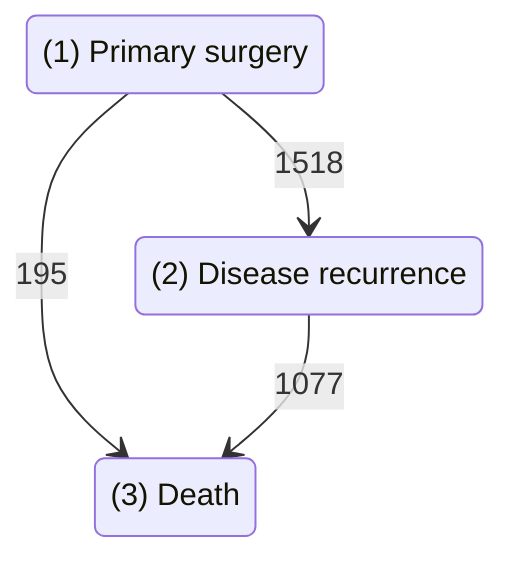

# PyMSM in a nutshell  


[Hagai Rossman](https://hrossman.github.io/), [Ayya Keshet](https://github.com/ayya-keshet), [Malka Gorfine](https://www.tau.ac.il/~gorfinem/) 2022


[](https://codecov.io/gh/hrossman/pymsm)
[](https://pypi.org/project/pymsm/)
[](https://doi.org/10.21105/joss.04566)

`PyMSM` is a Python package for fitting competing risks and multistate models, with a simple API which allows user-defined model, predictions at a single or population sample level, statistical summaries and figures.  

Features include:

- Fit a Competing risks Multistate model based on survival analysis (time-to-event) models.
- Deals with right censoring, competing events, recurrent events, left truncation, and time-dependent covariates.
- Run Monte-carlo simulations for paths emitted by the trained model and extract various summary statistics and plots.
- Load or configure a pre-defined model and run path simulations.
- Modularity and compatibility for different time-to-event models such as Survival Forests and other custom models.

For details, read the [JOSS paper](https://joss.theoj.org/papers/10.21105/joss.04566)  

## Installation

```console
pip install pymsm
```

Requires Python >=3.8

## Quick example

```py linenums="1"
# Load data (See Rotterdam example for full details)
from pymsm.datasets import prep_rotterdam
dataset, states_labels = prep_rotterdam()

# Define terminal states
terminal_states = [3]

#Init MultistateModel
from pymsm.multi_state_competing_risks_model import MultiStateModel
multi_state_model = MultiStateModel(dataset,terminal_states)

# Fit model to data
multi_state_model.fit()

# Run Monte-Carlo simulation and sample paths
mcs = multi_state_model.run_monte_carlo_simulation(
              sample_covariates = dataset[0].covariates.values,
              origin_state = 1,
              current_time = 0,
              max_transitions = 2,
              n_random_samples = 10,
              print_paths=True)
```



## Background and Motivation
Multi-state data are common, and could be used to describe trajectories in diverse health applications; such as  describing a patient's progression through disease stages or a patient’s path through different hospitalization states. When faced with such data, a researcher or clinician might seek to characterize the possible transitions between states, their occurrence probabilities, or to predict the trajectory of future patients - all conditioned on various baseline and time-varying individual covariates. By fitting a multi-state model, we can learn the hazard for each specific transition, which would later be used to predict future paths. Predicting paths could be used at a single patient level, for example predict how long until a cancer patient will be relapse-free given his current health status, or at what probability will a patient end a trajectory at any of the possible states; and at the population level, for example predicting how many patients which arrive at the emergency-room will need to be admitted, given their covariates. 

## Capabilities
PyMSM is a Python package for fitting multi-state models, with a simple API which allows user-defined models, predictions at a single or population sample level, and statistical summaries and figures.
Features of this software include:  
- Fitting a Competing risks Multistate model based on various types of survival analysis (time-to-event) such as Cox proportional hazards models or machine learning models, while taking into account right censoring, competing events, recurrent events, left truncation, and time-dependent covariates.  
- Running Monte-carlo simulations (in parallel computation) for paths emitted by the trained model and extracting various summary statistics and plots.  
- Loading or configuring a pre-defined model and generating simulated data in terms of random paths using model parameters, which could be highly useful as a research tool.  
- Modularity and compatibility for different time-to-event models such as Survival Forests and other custom ML models provided by the user.  
The package is designed to allow modular usage by both experienced researchers and non-expert users. In addition to fitting a multi-state model for a given data - PyMSM allows the user to simulate trajectories, thus creating a multi-state data-set, from a predefined model. This could be a valuable research tool - both for sharing sensitive simulated individual data and as a tool for any downstream task which needs individual trajectories.  


## Citation

If you found this library useful in academic research, please cite:

```bibtex
@article{Rossman2022, doi = {10.21105/joss.04566},
url = {https://doi.org/10.21105/joss.04566},
year = {2022},
author = {Hagai Rossman and Ayya Keshet and Malka Gorfine},
title = {PyMSM: Python package for Competing Risks and Multi-State models for Survival Data},
journal = {Journal of Open Source Software} }
```

Also consider starring the project [on GitHub](https://github.com/hrossman/pymsm)

This project is based on methods first introduced by the authors of [Roimi et. al. 2021](https://academic.oup.com/jamia/article/28/6/1188/6105188).  
 Original R code by Jonathan Somer, Asaf Ben Arie, Rom Gutman, Uri Shalit & Malka Gorfine available [here](https://github.com/JonathanSomer/covid-19-multi-state-model).
 Also see [Rossman & Meir et. al. 2021](https://www.nature.com/articles/s41467-021-22214-z) for an application of this model on COVID-19 hospitalizations data.
