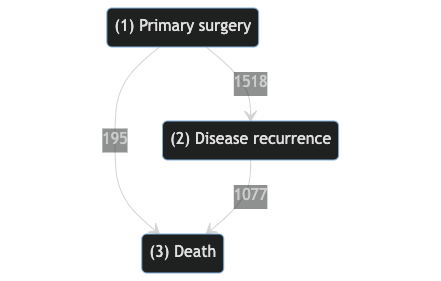

# Summary
Multi-state survival data are common, and can be used to describe trajectories in diverse applications such as a patient's health progression through disease states, pickups during the workday of a taxi driver, or a website browsing trajectory to name a few.
When faced with such data, a researcher or clinician might seek to characterize the possible transitions between states, their occurrence probabilities, or to predict the trajectory of future observations given various baseline and time-varying individual covariates (features). By fitting a multi-state model, we can learn the hazard for each specific transition, which would later be used to predict future paths. Predicting paths can be used at a single individual level, for example predicting how long a cancer patient will be relapse-free given his current health status, or at what probability will a patient end a trajectory at any of the possible states. At the population level paths predictions can be used, for example, to estimate how many patients which arrive at the emergency-room will need to be admitted, given their covariates. Moreover, their expected hospitalization duration can also be inferred, and provide planners with anticipated patients load.

# Statement of need

`PyMSM` is a Python package for fitting multi-state models, with a simple API which allows user-defined models, predictions at a single or population sample level, and various statistical summaries and figures.
Features of this software include:
\begin{itemize}
    \item Fitting competing risks and multi-state models based on various types of survival analysis (time-to-event) such as Cox proportional hazards models or machine learning models, while taking into account right censoring, competing events, recurrent events, left truncation, and time-dependent covariates. The number of states in the model, and the possible transitions between them will be determined by the user, as well as the number of competing risks when fitting a competing risks model.    
    \item Running Monte-Carlo simulations (in parallel computation) for paths emitted by the trained model and extracting various summary statistics and plots.
    \item Loading or configuring a pre-defined multi-state model and generating simulated multi-state survival data in terms of random paths, which can be highly useful as a research tool.
    \item Modularity and compatibility for different time-to-event models such as Survival Forests and other custom ML models provided by the user.
\end{itemize}
The package is designed to allow modular usage by both experienced researchers and non-expert users. In addition to fitting a multi-state model for a given data-set, `PyMSM` allows the user to simulate trajectories, thus creating a multi-state survival data-set, from a predefined model. This could be a valuable research tool, both for sharing sensitive simulated individual data and as a tool for any downstream task which needs individual trajectories.
To the authors best knowledge, this is the first open-source multi-state model tool that allows fitting of such models while also dealing with important concepts such as right censoring, competing events, recurrent events, left truncation, and time-dependent covariates.

# Usage examples
This project is based on methods first introduced during 2020 for predicting national COVID-19 hospitalizations in Israel. Important health policy applications based on these methods were built and used by government policymakers throughout the pandemic. For example, help assess hospital resource utilization [@Roimi:2021], and associations between high hospital load and excess deaths [@Rossman:2021]. 
A similar R version of this package is available in Roimi et. al. 2021, yet this is the first Python version to be released as an open-source package containing extended features and use cases.
Other usage examples are provided in the software package docs such as breast cancer state transitions (Rotterdam dataset - see Figure 1), AIDS competing-risk data, disease-stage data from the European Society for Blood and Marrow Transplantation (EBMT) and COVID-19 national hospitalizations.  

{ width=65% }

# The `PyMSM` package
A brief overview of the package functionality is described below. Detailed explanations of the API, along with four full usage examples on real data are available in the package documentation at https://hrossman.github.io/pymsm/.

## Model fitting
Fitting a multi-state model to a data-set requires only a few simple steps:
\begin{itemize}
    \item Preparing a data-set in one of two formats.
    \item Defining a function for updating time-dependent covariates.
    \item Defining covariates' columns.
    \item Defining terminal states.
    \item Defining a minimum number of data transitions needed to fit a transition.
\end{itemize}  
Once all the above is done, the user can fit a multi-state model to the data-set, and use it for downstream analyses.

## Path sampling
Using the previously fitted multi-state model, the user can sample paths using Monte-Carlo simulations. Given covariates, initial state and time, next states and times spent at each future state are sequentially sampled via the entire estimated multi-state model. The process concludes when the path arrives at a terminal state or the number of transitions exceeds a pre-defined maximum. Once a large number of paths have been sampled for each observation, the user can explore summary statistics such as the probability of being in any of the states or the median time spent in each state.

## Custom fitters
`PyMSM` works with Cox proportional hazards models by default using the lifelines [@Davidson-Pilon:2019] Python library, but also allows configuration of custom event-specific fitters.
EventSpecificFitter class is an abstract class which defines the API and needs to be subclassed by the user.

Some custom fitters are available off-the-shelf such as survival trees [@Ishwaran:2008] through the `scikit-survival` Python package [@Pölsterl:2020].

## Simulating Multi-state Survival Data
Using a pre-loaded or a pre-defined multi-state model, `PyMSM` provides an API to generate simulated data of random trajectories. Creating a simulated multi-state paths data-set could serve as a useful research tool in cases where data sharing is limited due to privacy limitations, or as a generation tool for any downstream task which requires individual trajectories.

# Models and Methods
In this section we give an overview of the multi-state models and methods underlying the statistical analysis and computations performed in `PyMSM`.

## Introduction
The description of the content of `PyMSM` is easier to digest under a given setting.  Thus, to set the stage, we adopt the multi-state model of Roimi [@Roimi:2021]. Specifically, assume a multi-state model consists of four states $A,B,C,D$ and six possible transitions:
$$
A \rightarrow B \,\,\,\,\,\,       A \rightarrow C   \,\,\,\,\,\,     A \rightarrow D   \,\,\,\,\,\,    B \rightarrow A \,\,\,\,\,\,    B \rightarrow D \,\,\,\,\,\,   C \rightarrow A \, .
$$
Each transition is characterized by a transition-specific hazard function, also known as a cause-specific hazard function,
$$
\lambda_{A,B} (t|Z) \,\,\, \lambda_{A,C} (t|Z) \,\,\, 	\lambda_{A,D} (t|Z) \,\,\, \lambda_{B,A} (t|Z)  \,\,\, \lambda_{B,D} (t|Z) \,\,\,  \lambda_{C,A} (t|Z) \,
$$
for $t > 0$ and a $Z$ vector of covariates. Although $Z$ is shared by the six models above,  it does not imply that identical covariates must be used in these models. For example, in Cox models with   transition-dependent   regression coefficient vectors,  one can set any specific coefficient to zero for excluding the corresponding covariate.  

Let $J_C$ and $J_N$ denote the current and next states, respectively, and $T$ denote the transition time. Assume the journey of an observation in the system described by the multi-state model starts at state $j^*$ with a vector of baseline covariates $W$. Let $Z(t)$ be a time-dependent vector of covariates, where
$$ 
Z(T)^T = (W^T,\widetilde{W}(T)^T)
$$
and $\widetilde{W}(t)$ is a time-dependent vector of covariates known at the entrance to the new state. Let $K_{j^*}$ be the set of possible states that can be reached directly from state $j^*$. Then, the conditional probability of transition $j^* \rightarrow j$, $j \in K_{j^*}$, by time $t$ given $Z(0)=Z$ is given by
$$
\Pr(T \leq t, J_N=j|J_C=j^*,Z(0)=Z) = \int_0^t \lambda_{j^*,j}(u|Z)\exp\left\{-\sum_{k=1}^{|K_{j^*}|} \Lambda_{j^*,k}(u-|Z) \right\} du \, ,
$$
where $u-$ is a time  just prior to $u$, $|K_{j^*}|$ is the cardinality of $K_{j^*}$ and  $\Lambda_{j,k}(t|Z)=\int_0^t \lambda_{j,k}(u|Z) du$ is the cumulative hazard function. In our example, if the first state $j^*=A$, $K_{j^*}=\{B,C,D\}$, and 

$$
\Pr(T \leq t, J_N=j|J_C=A,Z(0)=Z) = 
$$  
$$
\int_0^t \lambda_{A,j}(u|Z)\exp\left\{- \Lambda_{A,B}(u-|Z) - \Lambda_{A,C}(u-|Z) - \Lambda_{A,D}(u-|Z)\right\} du \, .
$$

The marginal probability of transition $j^* \rightarrow j$ is given by
$$
\Pr(J_N=j|J_C=j^*,Z(0)=Z) = \int_0^\infty \lambda_{j^*,j}(u|Z)\exp\left\{-\sum_{k=1}^{|K_{j^*}|} \Lambda_{j^*,k}(u-|Z) \right\} du \, ,
$$
and the probability of transition time less than $t$ given a transition $j^* \rightarrow j$
$$
\Pr(T \leq t | J_N=j,J_C=j^*, Z(0)=Z)
= \frac{ \int_0^t \lambda_{j^*,j}(u|Z)\exp\left\{-\sum_{k=1}^{|K_{j^*}|} \Lambda_{j^*,k}(u-|Z) \right\} du  }
{ \int_0^\infty \lambda_{j^*,j}(u|Z)\exp\left\{-\sum_{k=1}^{|K_{j^*}|} \Lambda_{j^*,k}(u-|Z) \right\} du  }  \, .
$$
Now assume an observation entered state $j'$ at time $t'>0$ with $Z(t')$. Then, the probability of $j' \rightarrow j$ by time $t$ is given by 
$$
\Pr(T \leq t, J_N=j|J_C=j',Z(t')=Z) = \int_{t'}^t \lambda_{j',j}(u|Z)\exp\left\{-\sum_{k=1}^{|K_{j'}|} \Lambda_{j',k}(u-|Z) \right\} du \, ,
$$
and
$$
\Pr(T \leq t| J_N=j,J_C=j',Z(t')=Z) = 
\frac{ \int_{t'}^t \lambda_{j',j}(u|Z)\exp\left\{-\sum_{k=1}^{|K_{j'}|} \Lambda_{j',k}(u-|Z) \right\} du }
{ \int_{t'}^\infty \lambda_{j',j}(u|Z)\exp\left\{-\sum_{k=1}^{|K_{j'}|} \Lambda_{j',k}(u-|Z) \right\} du } \, .
$$    
For all of the above, set the main multi-state model components required for prediction, as will be explained in the following sections.

## Estimation

### Cox transition-specific hazard models
The estimation procedure for the hazard functions that define the multi-state model can be chosen by the user. For example, if Cox models are adopted, where each transition $j \rightarrow j'$ consists of transition-specific unspecified baseline hazard function $\lambda_{0j,j'}(\cdot)$ and a 
transition-specific vector of regression coefficients $\beta_{j,j'}$, i.e.,
$$
\lambda_{j,j'}(t|Z) = \lambda_{0j,j'}(t) \exp(Z^T \beta_{j,j'}) \, ,
$$
the estimation procedure is straightforward. Specifically, under transition-specific semi-parametric Cox models, we can easily deal with 
right censoring and competing events based on the approach of Andersen & Keiding [@Andersen:1991]. Namely, maximization of the partial likelihood function in terms of all the involved  Cox models is done by maximizing the partial-likelihood of each transition separately, and temporarily treating competing events as censoring. Thus, we use the standard partial-likelihood estimators of $\beta_{j,j'}$ [@Klein:2006] and Breslow estimator of $\Lambda_{0j,j'}(t)=\int_0^t \lambda_{0j,j'}(u)du$ [@Breslow:1972]. 
Another important issue is left truncation which occurs at each transition that is not the origin state of the subject's path. Bias due to left truncation is eliminated by using the well-known risk-set correction [@Klein:2006]. 
Recurrent events, which occurs when subjects visit the same state multiple times, are accommodated by the robust standard errors [@Andersen:1982]. 	

Based on the estimates of the regression coefficients and the cumulative baseline hazard functions, all the distribution functions above can be estimated by replacing the integrals with sums over the observed failure times, replacing any unknown parameter by its estimator. Specifically, let $\tau_{j^*,j}$ be the largest observed event time of transition $j^* \rightarrow j$. Then, 
\begin{equation}
    \begin{gathered}
\widehat{\Pr} (J_N=j | J_C=j^*,Z(0)=Z) \\
    =   \sum_{t_m \leq \tau_{j^*,j}} \exp\left( \widehat\beta_{j^*,j}^T Z\right) \widehat\lambda_{0j^*,j}(t_m) \exp \left\{-\sum_{k=1}^{|K_{j^*}|} \widehat\Lambda_{0j^*,k}(t_{m-1})\exp\left( \widehat\beta_{j^*,k}^T Z\right) \right\} \, ,  
    \end{gathered}
\end{equation}

\begin{equation}
    \begin{gathered}
\widehat{\Pr} (T\leq t| J_N=j', J_C=j^* , Z(0)=Z)\\
    \hspace{0.5cm} = \frac{\sum_{t_m \leq t} \exp\left( \widehat\beta_{j^*,j'}^T Z\right) \widehat\lambda_{0j^*,j'}(t_m) \exp \left\{-\sum_{k=1}^{|K_{j^*}|} \widehat\Lambda_{0j^*,k}(t_{m-1})\exp\left( \widehat\beta_{j^*k}^T Z\right) \right\} }{ \sum_{t_m \leq \tau_{j^*,j'}} \exp\left( \widehat\beta_{j^*,j'}^T Z\right) \widehat\lambda_{0j^*,j'}(t_m) \exp \left\{-\sum_{k=1}^{K_{j^*}} \widehat\Lambda_{0j^*,k}(t_{m-1})\exp\left( \widehat\beta_{j^*,k}^T Z\right) \right\} } \, , 
    \end{gathered}
\end{equation}
and finally, given a new $\breve{j}$, the estimated probability of staying at state $j'$ less than or equal $t$ time units is given by
\begin{equation}
    \begin{gathered}
\widehat{\Pr} (T\leq t| J_N=\breve{j}, J_C=j' , Z(t')=Z) \\
    \hspace{0.5cm} = \frac{\sum_{t' < t_m \leq t} \exp\left( \widehat\beta_{j',\breve{j}}^T Z\right) \widehat\lambda_{0j',\breve{j}}(t_m) \exp \left\{-\sum_{k=1}^{|K_{j'}|} \widehat\Lambda_{0j',k}(t_{m-1})\exp\left( \widehat\beta_{j',k}^T Z\right) \right\} }{ \sum_{t' < t_m \leq \tau_{j',\breve{j}}} \exp\left( \widehat\beta_{j',\breve{j}}^T Z\right) \widehat\lambda_{0j',\breve{j}}(t_m) \exp \left\{-\sum_{k=1}^{K_{j'}} \widehat\Lambda_{0j',k}(t_{m-1})\exp\left( \widehat\beta_{j',k}^T Z\right) \right\} } \, .
    \end{gathered}
\end{equation}

### Other transition-specific models
The user can define other survival models and estimation procedures, such as accelerated failure time models, random survival forests [@Ishwaran:2008] etc, for each transition, as explained in section Custom Fitters above.

## Prediction - Monte-Carlo Simulation
Based on the multi-state model, we reconstruct the complete distribution of the path for a new observation, given the observed covariates $W$. Based on the reconstructed distribution we estimate the probability of visiting each state, the total length of stay at each state and the total length of stay in the entire system.

The above quantities can be predicted before entering the system and also during the stay at one of the systems' states, while correctly taking into account the accumulated time already spent in the system and $Z(\cdot)$.

We reconstruct the distribution of the path for a new observation by Monte-Carlo simulation. Assume the starting state (provided by the user) is $j^*$. Then, the next state $J_N$ is sampled based on the discrete conditional probabilities
$$
p_{j|j^*,Z}= \frac{\widehat{\Pr} (J_N=j | J_C=j^*, Z(0)=Z) }{\sum_{j'=1}^{|K_{j^*}|} \widehat{\Pr} (J_N=j' | J_C=j^*, Z(0)=Z)}  \, ,
$$
where $j \in K_{j^*}$. Once we sampled the next state, denoted by $j'$, the time to be spent at state $j^*$ is sampled based on 
$$
\widehat{\Pr} (T\leq t| J_N=j', J_C=j^* , Z(0)=Z) \, .
$$
This is done by sampling $U \sim Uniform[0,1]$, equating 
$$
U=\widehat{\Pr} (T\leq t| J_N=j', J_C=j^* , Z(0)=Z)
$$ 
and solving for $t$. Denote the sampled time by $t'$ and update $Z(t')$. In case $j'$ is a terminal state, the sampling path ends here. Otherwise, the current state is updated to $J_C=j'$, and the following state is sampled by $p_{j|j',Z(t')}$, $j=1 \in  K_{j'}$, 
$$
p_{j|j',Z}= \\
\frac{\sum_{t'<t_m \leq \tau_{j',j}} \exp\left(\widehat\beta_{j',j}^T Z\right)\widehat\lambda_{0j',j}(t_m)\exp\left\{-\sum_{k=1}^{|K_{j'}|}\widehat\Lambda_{0j',k}(t_{m-1})\exp\left(\widehat\beta_{j',k}^T Z\right) \right\} }
{\sum_{\widetilde{j}=1}^{|K_{j'}|} \sum_{t'<t_m \leq \tau_{j',\widetilde{j}}} \exp\left(\widehat\beta_{j',\widetilde{j}}^T Z\right) \widehat\lambda_{0j',\widetilde{j}}(t_m) \exp\left\{-\sum_{k=1}^{|K_{j'}|}\widehat\Lambda_{0j',k}(t_{m-1})\exp\left(\widehat\beta_{j',k}^T Z\right) \right\}} \, .
$$

## Generating Random Multistate Survival Data
`PyMSM` allows the user to pre-define a multi-state model. For example, for Cox models, the user should provide transition-specific baseline hazards, vectors of regression coefficients, and a time-varying covariates update function if needed. After providing this information, the user can then simulate trajectories, thus creating a new multi-state data-set which may be valuable for a variety of purposes.

# Acknowledgemnts
This project is based on Roimi 2021. We thank Jonathan Somer, Asaf Ben Arie, Rom Gutman, Tomer Meir and Uri Shalit for their work on the model, R code and valuable discussions. The work was partially supported by the Israel Science Foundation (ISF) grant number 767/21 and by a grant from the Tel Aviv University Center for AI and Data Science (TAD).

# References 
